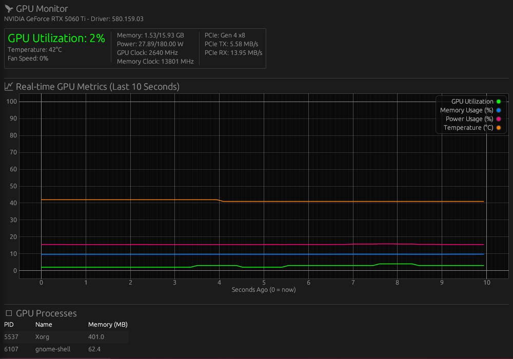

# RGM: Rust GPU Monitor

[](https://github.com/Neomelt/RGM/actions/workflows/ci.yml)
[](https://opensource.org/licenses/MIT)

A lightweight GPU monitoring utility built with Rust and egui. Supports **NVIDIA** (via NVML) and **AMD** (via sysfs/hwmon, including integrated GPUs). Simple, fast, and reliable.



## Features

*   **Multi-Vendor:** Automatically detects and monitors NVIDIA or AMD GPUs.
*   **iGPU Friendly:** Works with AMD integrated GPUs – unavailable sensors gracefully fall back to zero.
*   **Real-time Plots:** GPU utilization, memory, temperature, and power visualised over time.
*   **Low Overhead:** Built in Rust for maximum performance and minimal resource consumption.
*   **Desktop Integration:** `.deb`/`.rpm` packages install an application entry in app launchers (Show Apps).

## Prerequisites

Before you begin, ensure you have the following installed on your system:

1.  **Rust & Cargo:** If you don't have them, install them from [rust-lang.org](https://www.rust-lang.org/).
2.  **GPU Drivers (one of the following):**
    *   **NVIDIA:** Official NVIDIA drivers installed. Verify with `nvidia-smi`.
    *   **AMD:** The `amdgpu` kernel driver (included in most Linux kernels). Verify with `ls /sys/class/drm/card*/device/driver` pointing to `amdgpu`.

## Installation

### Method 1: Download Binary (Recommended)

Download the latest release for your Linux distribution from the [Releases Page](https://github.com/Neomelt/RGM/releases).

*   **Debian/Ubuntu:** Download the `.deb` file and install:
    ```bash
    sudo dpkg -i rgm-ui_*.deb
    ```
*   **Fedora/RHEL/openSUSE:** Download the `.rpm` file and install:
    ```bash
    sudo rpm -U rgm_ui-*.rpm
    ```
*   **Other Linux:** Download the `.tar.gz` and extract it; the binary is at `rgm/rgm` inside the archive. Run it from there or copy it into a directory on your `PATH`.

### Method 2: Install from Crates.io

If you have Rust installed, you can install RGM directly from crates.io:

```bash
cargo install rgm_ui
```

### Method 3: Build from Source

1.  **Clone the repository:**
    ```bash
    git clone https://github.com/Neomelt/RGM.git
    cd RGM
    ```

2.  **Build and install:**
    ```bash
    cargo install --path .
    ```

## Usage

The `.deb`/`.rpm` packages and both `cargo install` methods put the `rgm` binary on your `PATH` (the packages also add an app-launcher entry):

```bash
rgm
```

For the portable `.tar.gz`, run `rgm/rgm` from the extracted directory instead.

For development from a source checkout, use `cargo run --release` instead.

The application will auto-detect your GPU vendor and display real-time metrics.

---

## Troubleshooting

### NVIDIA

#### Error: `libnvidia-ml.so: cannot open shared object file`

This occurs when the application cannot find the NVIDIA Management Library (NVML), even if `nvidia-smi` works correctly.

**Solution:**

1.  **Find the NVML library path.**
    ```bash
    ldconfig -p | grep libnvidia-ml.so.1
    ```

2.  **Create a symbolic link.**
    ```bash
    sudo ln -s /lib/x86_64-linux-gnu/libnvidia-ml.so.1 /lib/x86_64-linux-gnu/libnvidia-ml.so
    ```

### AMD

#### Missing metrics (VRAM, fan speed, etc.)

Some AMD integrated GPUs do not expose all sysfs nodes. This is normal – RGM will display `0` for any unavailable metrics.

#### Permission denied reading sysfs

Running as a regular user should be sufficient for read-only monitoring. If you see permission errors, ensure your user has read access to `/sys/class/drm/card*/device/`.

## License

This project is licensed under either of:

*   Apache License, Version 2.0, ([LICENSE-APACHE](LICENSE-APACHE) or https://www.apache.org/licenses/LICENSE-2.0)
*   MIT license ([LICENSE-MIT](LICENSE-MIT) or https://opensource.org/licenses/MIT)

at your option.

### Contribution

Unless you explicitly state otherwise, any contribution intentionally submitted for inclusion in this project by you, as defined in the Apache-2.0 license, shall be dually licensed as above, without any additional terms or conditions.